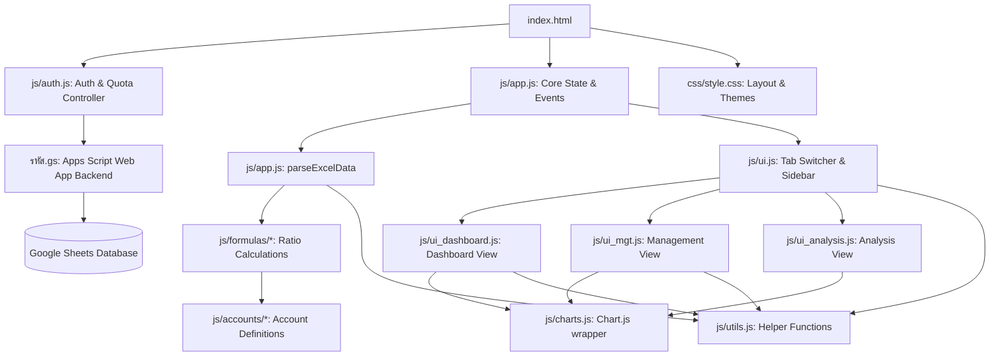

# MonthlyGL V0 - Codebase Mindmap & Navigation Guide

This document maps out the architecture, files, key states, and data flows of the MonthlyGL application. Use this guide to quickly locate which files and functions need modification for any given request without having to reread the entire codebase.

---

---

## 📂 File Registry & Key Responsibilities

### 1. Root Files
*   **[index.html](file:///c:/Users/sky_c/Desktop/ITEM/MonthlyGL/MonthlyGL%20V0/index.html)** (184 KB)
    *   *Role:* Holds the DOM layout, sidebar navigation, sub-tabs containers, metric detail modals, and standard script tags.
    *   *Where to edit:* Layout changes, adding new menus, changing CSS libraries, modifying modals.
*   **[css/style.css](file:///c:/Users/sky_c/Desktop/ITEM/MonthlyGL/MonthlyGL%20V0/css/style.css)** (24 KB)
    *   *Role:* Styling, layout flexbox/grid, modal customization, and color schemes.
    *   *Where to edit:* Theme styling, padding, alignment, responsive fixes.
*   **[รหัส.gs](file:///c:/Users/sky_c/Desktop/ITEM/MonthlyGL/MonthlyGL%20V0/%E0%B8%A3%E0%B8%AB%E0%B8%B1%E0%B8%AA.gs)** (4.2 KB)
    *   *Role:* Google Apps Script backend deployed as a Web App. Handles Google Sheet database operations for `login`, quota deduction (`deduct`), and password modifications (`changePassword`).
    *   *Where to edit:* Backend database actions, user account configurations, login/quota mechanics.

### 2. Core Controller, Auth & Data Flow
*   **[js/app.js](file:///c:/Users/sky_c/Desktop/ITEM/MonthlyGL/MonthlyGL%20V0/js/app.js)** (93 KB)
    *   *Role:* Application entry point, global event listeners (`setupEvents`), Excel file upload/drop handlers, Excel columns-to-data parsing (`parseExcelData`), trial balance validation (`validateAndNormalizeCode`), and formula invocation controller.
    *   *Key State Variables:*
        *   `monthlyResults` (Array): Storage for parsed and computed monthly trial balance outputs.
        *   `currentMainTab`, `currentSubTab`, `currentWCSubTab` (String): Track selected UI state.
        *   `window.hospitalData` (Object): Parsed hospital visit, AdjRW, and patient days stats data.
    *   *Where to edit:* Adding file upload listeners, modifying parse logic, mapping spreadsheet columns.
*   **[js/auth.js](file:///c:/Users/sky_c/Desktop/ITEM/MonthlyGL/MonthlyGL%20V0/js/auth.js)** (24 KB)
    *   *Role:* Authentication and usage quota management. Controls the login overlay, selection menu overlay, and profile panel in header. Communicates with `รหัส.gs` Web App.
    *   *Where to edit:* Login UI control, quota subtraction checks, user authentication events, password updates.
*   **[js/utils.js](file:///c:/Users/sky_c/Desktop/ITEM/MonthlyGL/MonthlyGL%20V0/js/utils.js)** (8.5 KB)
    *   *Role:* Common functions like `sumAccounts(tbData, prefix)`, `sumSpecificCodes()`, `lookupAccountName()`, and rounding.
    *   *Where to edit:* Adding standard mathematical or parsing utility helpers.

### 3. UI & Rendering Modules
*   **[js/ui.js](file:///c:/Users/sky_c/Desktop/ITEM/MonthlyGL/MonthlyGL%20V0/js/ui.js)** (107.5 KB)
    *   *Role:* Tab navigation controller (`switchMainTab`), sidebar generation (`renderUnifiedSidebar`), Trial Balance tables (`renderTrialBalanceTable`), Financial Statements, and custom dropdown controllers.
    *   *Where to edit:* Trial balance table styling, adding a new tab, custom search filters, global date range controls.
*   **[js/ui_dashboard.js](file:///c:/Users/sky_c/Desktop/ITEM/MonthlyGL/MonthlyGL%20V0/js/ui_dashboard.js)** (96.9 KB)
    *   *Role:* Renders the core Dashboard KPIs, progress bars (`getProgressBarHtml`), alerts/warnings calculations (`renderAlerts`), metric popup modals (`openDashMetricModal`), and breakdown tables.
    *   *Where to edit:* Adding/updating Dashboard KPIs, warning conditions, modal charts, breakdown details.
*   **[js/ui_mgt.js](file:///c:/Users/sky_c/Desktop/ITEM/MonthlyGL/MonthlyGL%20V0/js/ui_mgt.js)** (84 KB)
    *   *Role:* Management Report table renderer (`renderManagementReport`), Trend charts, and management check-lists.
    *   *Where to edit:* Management codes mapping display order, hidden flags, management table layout.
*   **[js/ui_analysis.js](file:///c:/Users/sky_c/Desktop/ITEM/MonthlyGL/MonthlyGL%20V0/js/ui_analysis.js)** (108 KB)
    *   *Role:* Analysis tab sub-views renderer (e.g. Financial Distress, Compare periods, trend indicators).
    *   *Where to edit:* Financial distress criteria, period comparison visuals.
*   **[js/charts.js](file:///c:/Users/sky_c/Desktop/ITEM/MonthlyGL/MonthlyGL%20V0/js/charts.js)** (51.6 KB)
    *   *Role:* Wraps Chart.js library to draw dashboard, management, and trend charts.
    *   *Where to edit:* Chart colors, axis properties, tooltip formatting, and zoom controls.

### 4. Account Maps & Configurations (`js/accounts/`)
These files map account codes to names or parent groups.
*   **[accounts_ar.js](file:///c:/Users/sky_c/Desktop/ITEM/MonthlyGL/MonthlyGL%20V0/js/accounts/accounts_ar.js)** (29.1 KB): Accounts Receivable groups & rules.
*   **[accounts_ap.js](file:///c:/Users/sky_c/Desktop/ITEM/MonthlyGL/MonthlyGL%20V0/js/accounts/accounts_ap.js)** (11.7 KB): Accounts Payable groups & configs.
*   **[accounts_inv.js](file:///c:/Users/sky_c/Desktop/ITEM/MonthlyGL/MonthlyGL%20V0/js/accounts/accounts_inv.js)** (0.6 KB): Inventory account categories.
*   **[accounts_pr.js](file:///c:/Users/sky_c/Desktop/ITEM/MonthlyGL/MonthlyGL%20V0/js/accounts/accounts_pr.js)** (3.1 KB): Payroll (PR) account groupings.
*   **[accounts_mgt.js](file:///c:/Users/sky_c/Desktop/ITEM/MonthlyGL/MonthlyGL%20V0/js/accounts/accounts_mgt.js)** (204.4 KB): Management Accounts structures (large mappings).

### 5. Mathematical Ratios & Formulas (`js/formulas/`)
These files perform mathematical derivations on trial balance balances.
*   **[formulas_dashboard.js](file:///c:/Users/sky_c/Desktop/ITEM/MonthlyGL/MonthlyGL%20V0/js/formulas/formulas_dashboard.js)** (14.5 KB): Computes working capital metrics, quick ratio, debt ratio, net profit margin, cash cycle, etc.
*   **[formulas_ar.js](file:///c:/Users/sky_c/Desktop/ITEM/MonthlyGL/MonthlyGL%20V0/js/formulas/formulas_ar.js)** (4.6 KB): AR turnover days, specific group ratios.
*   **[formulas_ap.js](file:///c:/Users/sky_c/Desktop/ITEM/MonthlyGL/MonthlyGL%20V0/js/formulas/formulas_ap.js)** (9.6 KB): AP turnover days, specific vendor ratios.
*   **[formulas_inv.js](file:///c:/Users/sky_c/Desktop/ITEM/MonthlyGL/MonthlyGL%20V0/js/formulas/formulas_inv.js)** (3.0 KB): Inventory turnover metrics.
*   **[formulas_pr.js](file:///c:/Users/sky_c/Desktop/ITEM/MonthlyGL/MonthlyGL%20V0/js/formulas/formulas_pr.js)** (6.8 KB): Payroll and accrued expenses formulas.
*   **[formulas_distress.js](file:///c:/Users/sky_c/Desktop/ITEM/MonthlyGL/MonthlyGL%20V0/js/formulas/formulas_distress.js)** (12.4 KB): MOPH 7-Level Financial Distress Risk Scoring calculations.
*   **[formulas_waterfall.js](file:///c:/Users/sky_c/Desktop/ITEM/MonthlyGL/MonthlyGL%20V0/js/formulas/formulas_waterfall.js)** (4.8 KB): Waterfall P&L YTD categories calculation.
*   **[formulas_treatment_cost.js](file:///c:/Users/sky_c/Desktop/ITEM/MonthlyGL/MonthlyGL%20V0/js/formulas/formulas_treatment_cost.js)** (15.0 KB): OPD/IPD treatment cost apportionment calculation.
*   **[formulas_financial_statements.js](file:///c:/Users/sky_c/Desktop/ITEM/MonthlyGL/MonthlyGL%20V0/js/formulas/formulas_financial_statements.js)** (3.9 KB): YTD Standard Financial Statements (Balance Sheet, P&L) calculation.

---

## 🛠️ Quick Modification Map (Where to go when requested to...)

| Request / Feature Task | Files to Edit | Focus Locations / Key Functions |
| :--- | :--- | :--- |
| **1. Add or change a Dashboard KPI/Metric** | `index.html` `js/formulas/formulas_dashboard.js` `js/ui_dashboard.js` | • Add metric UI container in `index.html` • Calculate the metric value in `formulas_dashboard.js` • Format & render in `ui_dashboard.js` (`renderDashboard`, `openDashMetricModal`) |
| **2. Edit Excel/File parsing logic or templates** | `js/app.js` | • Check `parseExcelData(rows)` to modify how it parses worksheet rows and parses amounts/descriptions. |
| **3. Update formulas or account groupings** | `js/formulas/*` `js/accounts/*` | • Update mappings in `js/accounts/...` (e.g. `accounts_ar.js`) for grouping changes. • Update computation in `js/formulas/...` (e.g. `formulas_ar.js`). |
| **4. Modify/Format Trial Balance & Financial Statements** | `js/ui.js` | • Check `renderTrialBalanceTable()` or `renderFinancialStatements()` to adjust table structures or categories. |
| **5. Edit layout, menus, or navigation sidebar** | `index.html` `js/ui.js` | • Adjust DOM elements in `index.html`. • Adjust `switchMainTab()` and `renderUnifiedSidebar()` in `ui.js`. |
| **6. Modify charts, colors, tooltips or legends** | `js/charts.js` | • Edit functions like `createOrUpdateLineChart`, `createBarChart` to adjust Chart.js options. |
| **7. Add warnings, alarms or performance thresholds** | `js/ui_dashboard.js` | • Adjust threshold limits inside `renderAlerts()` or config limits. |
| **8. Edit login logic, change passwords, or quota restrictions** | `js/auth.js` `รหัส.gs` `index.html` | • Adjust login fetch requests/actions in `js/auth.js` (`setupAuthUI`). • Modify backend sheets API actions `login`, `deduct`, `changePassword` in `รหัส.gs`. |
